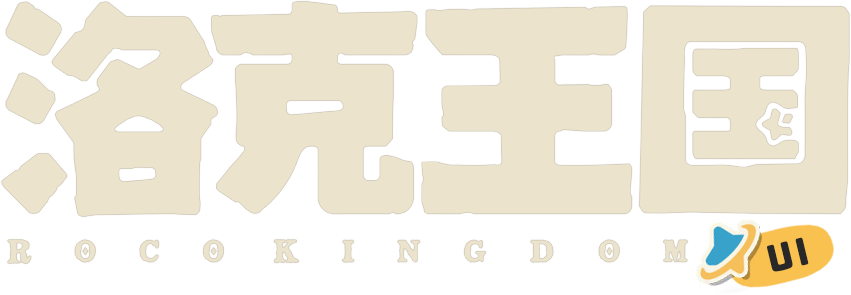

<p align="center">
  
</p>

<p align="center">
  =22.12.0" />
  
  
  
  
  
  
</p>

# Roco Kingdom UI

Roco Kingdom UI 是面向洛克王国风格界面的前端 monorepo，包含 React 组件库、图标、设计 token、共享工具和官网示例应用。

## 项目结构

```txt
apps/
  website/          官网与组件示例
packages/
  ui/               React 组件库，包名 rocokingdom-ui
  icons/            图标库，包名 @rocokingdom-ui/icons
  tokens/           设计 token，包名 @rocokingdom-ui/tokens
  shared/           共享基础能力
  utils/            通用工具
```

## 技术栈

- Vite+ 统一工具链
- React
- TypeScript
- Tailwind CSS
- Radix UI

## 开发

安装依赖：

```bash
vp install
```

启动官网开发服务：

```bash
vp run dev
```

检查、测试并构建整个 workspace：

```bash
vp run ready
```

分别运行测试和构建：

```bash
vp run -r test
vp run -r build
```

## 包命令

组件库、图标库、tokens、shared 和 utils 包都遵循相同的 Vite+ 脚本：

```bash
vp run <package>#dev
vp run <package>#check
vp run <package>#test
vp run <package>#build
```

例如：

```bash
vp run rocokingdom-ui#build
vp run @rocokingdom-ui/icons#build
```
